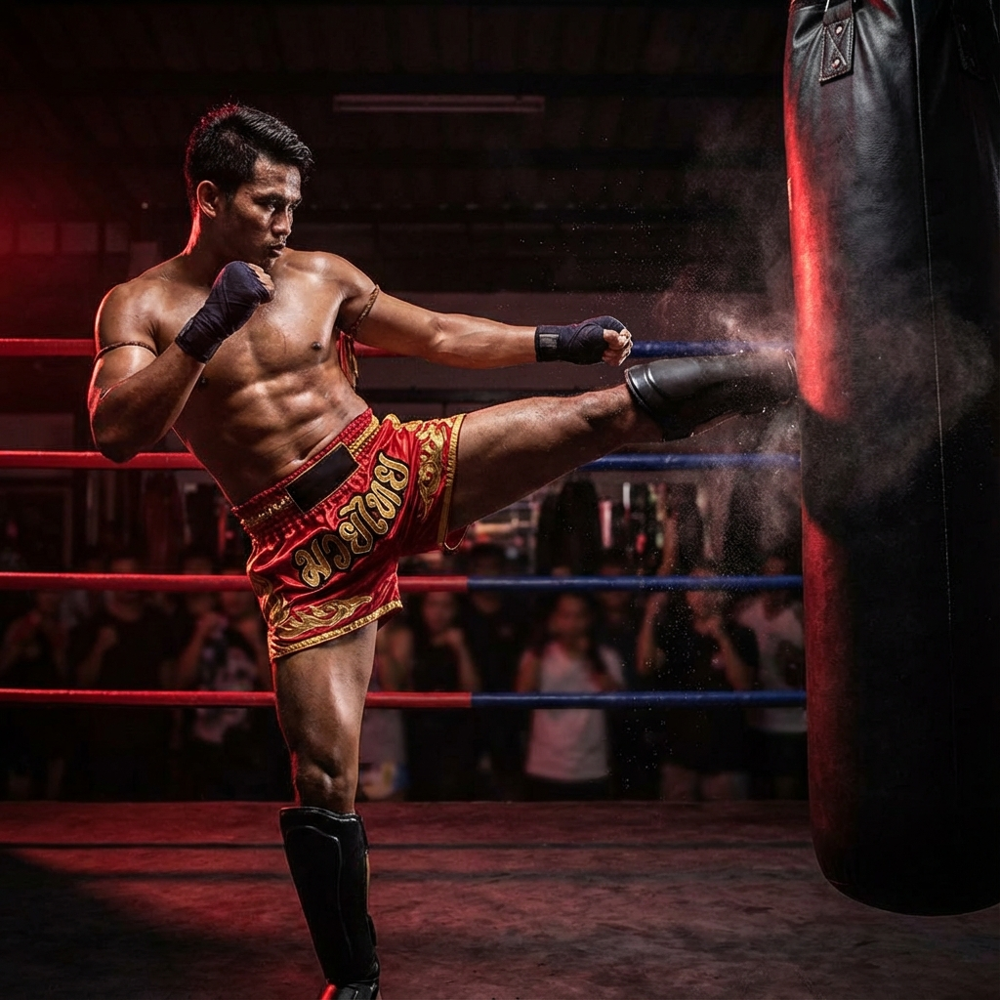

# Guía SEO - Boonchuay Gym

## ✅ Optimizaciones SEO Implementadas

### 1. Meta Tags Optimizados

#### Title Tag
```html
<title>Boonchuay Gym Sant Boi | Gimnasio Muay Thai, Boxeo, MMA, JKD y Kali</title>
```
- **Longitud**: ~65 caracteres (óptimo para Google)
- **Keywords incluidas**: Sant Boi, Muay Thai, Boxeo, MMA, JKD, Kali
- **Localización**: Sant Boi prominente al inicio

#### Meta Description
```html
<meta name="description" content="🥊 Gimnasio de artes marciales en Sant Boi de Llobregat. Clases de Muay Thai, Boxeo, MMA, Jeet Kune Do y Kali. Prueba gratis. Adultos y niños. ☎️ 931 70 98 45">
```
- **Longitud**: ~155 caracteres (óptimo)
- **Call-to-action**: "Prueba gratis"
- **Emojis**: Aumentan CTR en resultados
- **Teléfono**: Facilita contacto directo

#### Keywords Meta
```
gimnasio sant boi, muay thai sant boi, boxeo sant boi, mma sant boi, artes marciales sant boi, jeet kune do barcelona, kali barcelona, gimnasio artes marciales barcelona, clases boxeo sant boi, clases muay thai, defensa personal sant boi, boonchuay gym
```

### 2. Schema.org Structured Data (JSON-LD)

Implementado **SportsActivityLocation** schema con:
- ✅ Nombre del negocio
- ✅ Dirección completa
- ✅ Coordenadas GPS (41.3467, 2.0389)
- ✅ Teléfono en formato internacional (+34931709845)
- ✅ Horarios de apertura
- ✅ Servicios ofrecidos (5 disciplinas)
- ✅ Área de servicio (Sant Boi de Llobregat)
- ✅ Redes sociales

**Beneficio**: Google mostrará rich snippets con horarios, ubicación y valoraciones

### 3. Geo-Targeting Local

```html
<meta name="geo.region" content="ES-CT">
<meta name="geo.placename" content="Sant Boi de Llobregat">
<meta name="geo.position" content="41.3467;2.0389">
```

**Beneficio**: Mejora posicionamiento en búsquedas locales

### 4. Open Graph Tags (Redes Sociales)

- ✅ Facebook optimizado
- ✅ LinkedIn optimizado
- ✅ WhatsApp optimizado
- ✅ Imagen destacada (1200x630px)

**Beneficio**: Compartir en redes sociales muestra preview atractivo

### 5. Twitter Cards

```html
<meta name="twitter:card" content="summary_large_image">
```

**Beneficio**: Preview optimizado al compartir en Twitter/X

### 6. Canonical URL

```html
<link rel="canonical" href="https://www.boonchuaygym.com/">
```

**Beneficio**: Evita contenido duplicado

### 7. Sitemap XML

Archivo: `sitemap.xml`
- ✅ Homepage (priority 1.0)
- ✅ Secciones principales
- ✅ Referencias a imágenes
- ✅ Frecuencia de actualización

### 8. Robots.txt

Archivo: `robots.txt`
- ✅ Permite crawling de contenido público
- ✅ Bloquea áreas sensibles (/config/, /database/)
- ✅ Referencia al sitemap
- ✅ Crawl-delay configurado

### 9. Imágenes Optimizadas

- ✅ Alt tags descriptivos con keywords
- ✅ Lazy loading implementado
- ✅ Schema markup en imágenes
- ✅ Nombres de archivo SEO-friendly

Ejemplo:
```html

```

---

## 🎯 Keywords Objetivo

### Keywords Principales (Alta Prioridad)
1. **gimnasio sant boi** - Volumen alto, competencia media
2. **muay thai sant boi** - Volumen medio, competencia baja
3. **boxeo sant boi** - Volumen medio, competencia baja
4. **mma sant boi** - Volumen bajo, competencia muy baja
5. **artes marciales sant boi** - Volumen medio, competencia media

### Keywords Secundarias
- clases muay thai barcelona
- gimnasio artes marciales barcelona
- defensa personal sant boi
- jeet kune do barcelona
- kali barcelona
- clases boxeo sant boi

### Long-tail Keywords
- gimnasio muay thai sant boi de llobregat
- clases boxeo para niños sant boi
- donde entrenar mma en sant boi
- mejor gimnasio artes marciales sant boi

---

## 📊 Acciones Adicionales Recomendadas

### 1. Google My Business (CRÍTICO)
```
✅ Crear perfil de Google My Business
✅ Verificar ubicación
✅ Añadir fotos del gimnasio
✅ Solicitar reseñas a clientes
✅ Publicar actualizaciones semanales
✅ Responder a todas las reseñas
```

**Impacto**: Aparición en Google Maps y Local Pack (top 3 resultados locales)

### 2. Contenido Local

Crear páginas/secciones adicionales:
- Blog con artículos sobre artes marciales
- Página "Por qué elegir Boonchuay Gym"
- Testimonios de alumnos
- Galería de fotos/vídeos
- Eventos y competiciones

### 3. Backlinks Locales

Conseguir enlaces de:
- Directorio de empresas de Sant Boi
- Ayuntamiento de Sant Boi
- Federaciones de artes marciales
- Blogs deportivos locales
- Periódicos locales (El Llobregat, etc.)

### 4. Redes Sociales

Optimizar perfiles:
- ✅ Facebook Business Page
- ✅ Instagram Business
- ✅ YouTube (vídeos de entrenamientos)
- ✅ TikTok (contenido viral)
- ✅ Google Maps

### 5. Velocidad de Carga

Optimizaciones técnicas:
- Comprimir imágenes (WebP format)
- Minificar CSS/JS
- Implementar caché
- CDN para assets estáticos
- Lazy loading (ya implementado)

### 6. Mobile-First

- ✅ Diseño responsive (ya implementado)
- Verificar en Google Mobile-Friendly Test
- Optimizar velocidad móvil
- Botones de llamada click-to-call

### 7. Reseñas Online

Plataformas clave:
- Google My Business (CRÍTICO)
- Facebook
- Yelp
- Foursquare
- TripAdvisor (si aplica)

**Objetivo**: Mínimo 20 reseñas con 4.5+ estrellas

---

## 📈 Métricas a Monitorizar

### Google Search Console
- Impresiones
- Clicks
- CTR
- Posición media
- Errores de indexación

### Google Analytics
- Tráfico orgánico
- Tasa de rebote
- Tiempo en página
- Conversiones (formulario contacto)
- Fuentes de tráfico

### Herramientas SEO
- **Google PageSpeed Insights**: Velocidad
- **Google Mobile-Friendly Test**: Compatibilidad móvil
- **Rich Results Test**: Validar schema markup
- **Ahrefs/SEMrush**: Posicionamiento keywords

---

## 🏆 Estrategia de Posicionamiento

### Fase 1: Fundación (Mes 1-2)
1. ✅ Optimización on-page (COMPLETADO)
2. Crear Google My Business
3. Conseguir primeras 10 reseñas
4. Publicar 4 artículos de blog

### Fase 2: Crecimiento (Mes 3-6)
1. Conseguir 10 backlinks locales
2. Publicar contenido semanal
3. Alcanzar 30+ reseñas
4. Optimizar velocidad de carga

### Fase 3: Dominación (Mes 7-12)
1. Posición #1 para "gimnasio sant boi"
2. Top 3 para todas las keywords principales
3. 50+ reseñas 5 estrellas
4. Autoridad de dominio 30+

---

## ✅ Checklist de Implementación

### Inmediato (Ya Hecho)
- [x] Meta tags optimizados
- [x] Schema.org markup
- [x] Open Graph tags
- [x] Sitemap.xml
- [x] Robots.txt
- [x] Alt tags en imágenes
- [x] Canonical URL

### Próximos Pasos (Hacer Ahora)
- [ ] Crear Google My Business
- [ ] Verificar en Google Search Console
- [ ] Añadir Google Analytics
- [ ] Comprimir imágenes a WebP
- [ ] Crear perfil Facebook Business
- [ ] Solicitar primeras reseñas

### Mediano Plazo (1-3 meses)
- [ ] Publicar 10 artículos de blog
- [ ] Conseguir 20 backlinks
- [ ] 30+ reseñas Google
- [ ] Vídeos en YouTube
- [ ] Optimizar Core Web Vitals

---

## 🔗 URLs Importantes

- **Google Search Console**: https://search.google.com/search-console
- **Google My Business**: https://business.google.com
- **Google PageSpeed**: https://pagespeed.web.dev
- **Rich Results Test**: https://search.google.com/test/rich-results
- **Mobile-Friendly Test**: https://search.google.com/test/mobile-friendly

---

## 💡 Tips Finales

1. **Consistencia NAP**: Nombre, Dirección, Teléfono deben ser idénticos en todas las plataformas
2. **Contenido local**: Mencionar Sant Boi, Barcelona, Baix Llobregat en contenidos
3. **Actualización regular**: Google premia sitios que se actualizan frecuentemente
4. **Experiencia de usuario**: Tiempo de carga < 3 segundos
5. **Mobile-first**: 70% de búsquedas son desde móvil

---

**Estado SEO Actual**: ⭐⭐⭐⭐ (4/5)
**Potencial de Ranking**: 🚀 ALTO

Con estas optimizaciones, Boonchuay Gym tiene excelentes posibilidades de aparecer en el **Top 3** de resultados locales para búsquedas relacionadas con artes marciales en Sant Boi de Llobregat.
